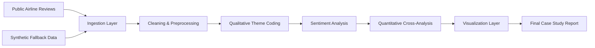

# Airline Disruption & Service Recovery | Mixed-Methods CX Research Case Study

This repository is a portfolio-ready UX and customer-experience research project that analyzes airline disruption feedback to identify what breaks during delays, cancellations, rebooking, refunds, baggage handling, and service recovery.

## Summary

- **What this is:** a mixed-methods CX case study built in Python using public airline review data plus a synthetic fallback dataset.
- **Why it matters:** disruptions are often unavoidable, but poor communication, unclear refunds, and weak recovery design turn operational issues into loyalty damage.
- **What I built:** a reproducible pipeline for ingestion, cleaning, qualitative theme coding, sentiment scoring, quantitative cross-analysis, visualization, and final reporting.
- **Who this is for:** UX research, customer experience, service design, and product roles that need evidence-backed insight from messy real-world customer feedback.

## Start Here

- Final case study: [`reports/final_case_study.md`](reports/final_case_study.md)
- Dashboard figure: [`outputs/figures/cx_research_dashboard.png`](outputs/figures/cx_research_dashboard.png)
- Resume bullets: [`reports/resume_project_summary.md`](reports/resume_project_summary.md)
- GitHub / LinkedIn blurb: [`reports/linkedin_github_project_description.md`](reports/linkedin_github_project_description.md)

## Why This Project Matters

Airline disruptions are high-friction service moments. Customers do not judge the experience only by whether a flight was delayed or canceled. They judge it by whether the airline explained what was happening, made the next step obvious, handled refunds transparently, and showed ownership during recovery.

This project turns unstructured customer feedback into a structured UX research story: where the pain is concentrated, which failure modes create the strongest negative sentiment, and what recovery behaviors appear to preserve trust.

## Methods Used

- **Qualitative:** rule-based multi-label theme coding, example quotes, theme dictionaries designed for future refinement
- **Quantitative:** theme frequency counts, sentiment analysis, cross-tabs, phrase analysis, rating summaries, and pain-point combinations
- **Tools:** Python, pandas, numpy, scikit-learn, matplotlib
- **Data:** public Skytrax airline reviews plus a reproducible synthetic fallback dataset

## Key Insights

These findings come from the current combined-source run of the pipeline with **41,790 cleaned reviews across 370 airlines**.

- `delay frustration` was the largest disruption-related theme with **8,200 reviews (19.6%)**
- `baggage problems` followed with **6,316 reviews (15.1%)**
- The most negative themes were `trust / loyalty damage` (**95.2% negative**), `digital / app / website issues` (**89.7% negative**), `pricing / compensation dissatisfaction` (**86.1% negative**), and `cancellation stress` (**84.9% negative**)
- The most common co-occurring issue was `delay frustration + baggage problems` with **1,600 reviews**
- `staff helpfulness` and `successful recovery experience` were the clearest positive recovery signals, with recommendation shares above **75%**

## Business Recommendations

- **Proactive delay communication:** push timely updates, expected resolution windows, and clear next steps across app, SMS, email, and gate signage
- **Refund status transparency:** show refund stage, timing, and voucher-vs-cash logic clearly so customers are not forced into support loops
- **Smoother rebooking flows:** preserve seats, surface alternate itineraries quickly, and keep policies consistent across app, kiosk, and agent channels
- **Better service recovery messaging:** equip frontline staff with scripts that acknowledge the problem, explain the current state, and confirm the next action
- **Compensation clarity:** make voucher, hotel, meal, and reimbursement rules visible during disruption handling, not buried after the trip

## Project Architecture



## Repository Guide

- `src/airline_cx_case_study/collect_data.py`: public-data ingestion and source selection
- `src/airline_cx_case_study/clean_preprocess.py`: cleaning, normalization, analysis text creation, and data quality reporting
- `src/airline_cx_case_study/qualitative_theme_coding.py`: reusable rule-based theme coding
- `src/airline_cx_case_study/sentiment_analysis.py`: lightweight reproducible sentiment scoring
- `src/airline_cx_case_study/frequency_analysis.py`: quantitative summaries, cross-tabs, and phrase analysis
- `src/airline_cx_case_study/visualization.py`: recruiter-friendly charts and dashboard output
- `src/airline_cx_case_study/report_generation.py`: final case study, resume summary, and GitHub / LinkedIn project copy

## Key Deliverables

- [`reports/final_case_study.md`](reports/final_case_study.md): polished portfolio case study
- [`outputs/figures/cx_research_dashboard.png`](outputs/figures/cx_research_dashboard.png): summary dashboard
- [`outputs/figures/theme_counts.png`](outputs/figures/theme_counts.png): top customer pain points
- [`outputs/figures/negative_sentiment_by_theme.png`](outputs/figures/negative_sentiment_by_theme.png): themes most associated with negative sentiment
- [`data/processed/theme_frequency_summary.csv`](data/processed/theme_frequency_summary.csv): review-level theme frequency summary
- [`data/processed/theme_vs_sentiment_crosstab.csv`](data/processed/theme_vs_sentiment_crosstab.csv): theme vs sentiment cross-analysis
- [`data/processed/pain_point_combinations_summary.csv`](data/processed/pain_point_combinations_summary.csv): co-occurring pain points

## How To Run

### Quick Start

```powershell
python -m venv .venv
.venv\Scripts\Activate.ps1
pip install -r requirements.txt
python run_pipeline.py --source-mode combined
```

### Main Output Files

- [`reports/final_case_study.md`](reports/final_case_study.md)
- [`outputs/figures/cx_research_dashboard.png`](outputs/figures/cx_research_dashboard.png)
- [`reports/resume_project_summary.md`](reports/resume_project_summary.md)

### Optional Source Modes

```powershell
python run_pipeline.py --source-mode public
python run_pipeline.py --source-mode synthetic
python run_pipeline.py --source-mode combined
```

### Run One Stage At A Time

```powershell
python -m src.airline_cx_case_study.collect_data --source-mode combined
python -m src.airline_cx_case_study.clean_preprocess
python -m src.airline_cx_case_study.qualitative_theme_coding
python -m src.airline_cx_case_study.sentiment_analysis
python -m src.airline_cx_case_study.frequency_analysis
python -m src.airline_cx_case_study.visualization
python -m src.airline_cx_case_study.report_generation
```

## Data Sources

- Primary dataset: public [Skytrax User Reviews Dataset](https://github.com/quankiquanki/skytrax-reviews-dataset)
- Downloaded source file used here: [`airline.csv`](https://raw.githubusercontent.com/quankiquanki/skytrax-reviews-dataset/master/data/airline.csv)
- Fallback source: reproducible synthetic dataset generated locally for pipeline resilience

## Limitations

- Public reviews are self-selected and should be treated as directional evidence, not a complete operational benchmark
- Theme coding and sentiment scoring are intentionally transparent and lightweight, but they should be validated on a manual sample before making stronger claims
- The source data spans a long historical window, so the project emphasizes experience patterns more than time-series trend claims

## Why This Fits Mixed-Methods UX / CX Roles

- Connects unstructured customer language to service design opportunities
- Combines qualitative interpretation with quantitative evidence
- Produces artifacts that are useful in research, product, and stakeholder conversations
- Keeps the workflow explainable, reproducible, and easy to extend

## Suggested Public Data Extensions

- U.S. DOT Air Travel Consumer Reports for structured complaint benchmarking
- Twitter airline sentiment datasets for short-form service language
- Additional review corpora for cross-source validation
