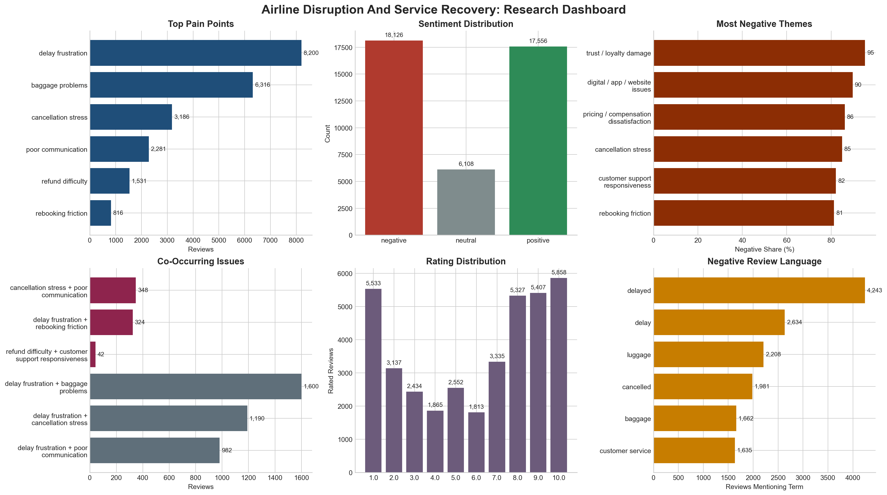
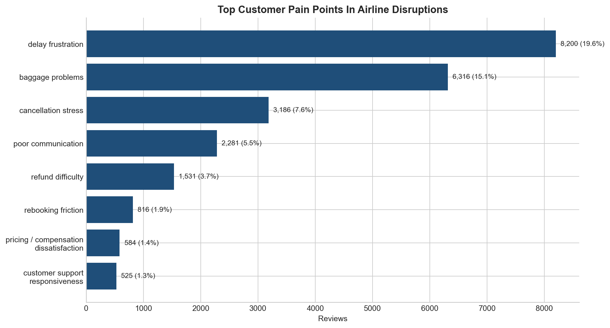
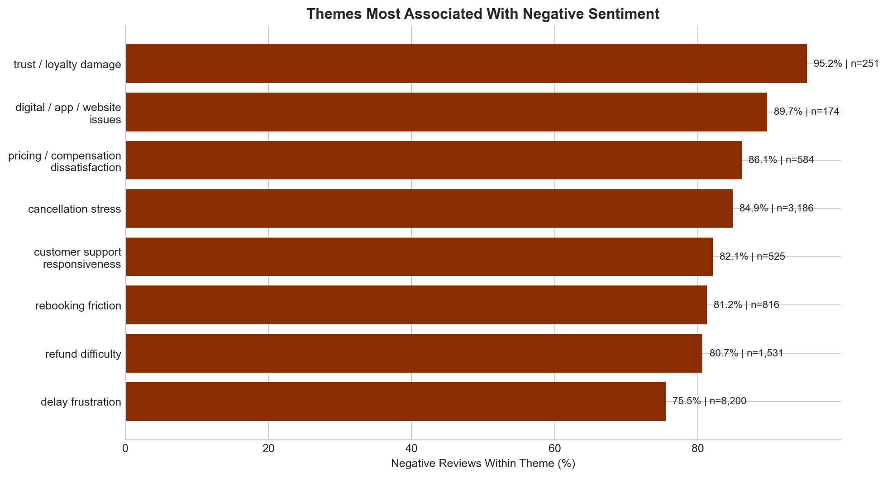
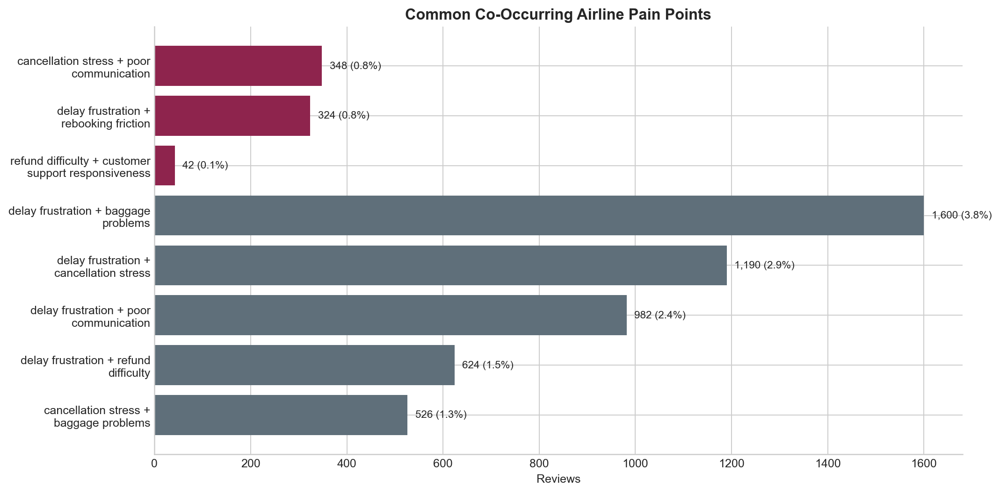
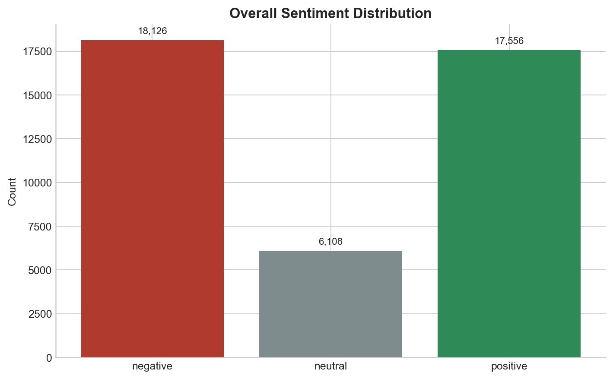
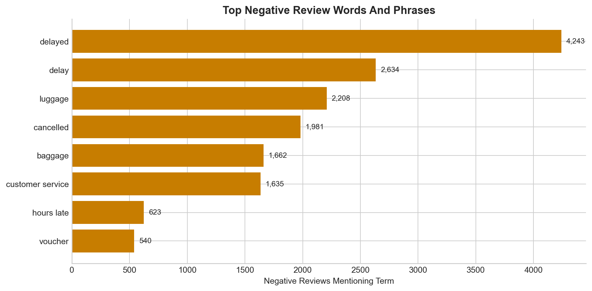

# Customer Experience Research Case Study: Airline Disruption and Service Recovery

## Business Context
Airline disruptions are operationally unavoidable, but customer perception is shaped by the recovery experience: how quickly customers are informed, how easily they can rebook, how transparently refunds are handled, and whether frontline teams show ownership when things go wrong.
For this project, I analyzed 41,790 cleaned review records across 370 airlines to identify where disruption experiences break down and where service recovery still protects trust. The current combined run uses 41,370 public reviews (99.0%) and 420 synthetic fallback reviews (1.0%).

## Research Objective
The objective was to build a portfolio-ready mixed-methods customer-experience research workflow that answers three practical questions:
- Which disruption and service-recovery pain points appear most often in airline customer feedback?
- Which themes are most strongly associated with negative sentiment and low recommendation intent?
- What recovery behaviors appear to soften the impact of delays, cancellations, baggage issues, and refund friction?

## Data Sources And Limitations
The primary source is the public Skytrax airline review dataset, supplemented in this run by a small synthetic fallback file used to preserve pipeline coverage if public inputs are missing.
- Current analysis base: 41,790 cleaned reviews, 370 airlines, average observed rating 6.00, median rating 7.00.
- Recommendation rate in the cleaned dataset: 53.09%.
- Public review data is self-selected and likely over-represents unusually strong positive or negative experiences; it should be treated as directional CX evidence rather than a direct measure of operational incidence.
- The source dataset spans a long historical window and includes inconsistent rating coverage; some dates are clearly imperfect or reflect source-formatting artifacts, so this project emphasizes thematic patterns over time-series claims.
- Theme coding and sentiment analysis are deliberately rule-based for transparency and reproducibility. They are strong for a first-pass portfolio study, but not a substitute for manual validation.

## Methodology
1. Ingested a public downloadable airline review file and standardized it into a common schema.
2. Cleaned text fields, removed exact duplicate reviews, normalized airline names where possible, and created a single `analysis_text` field.
3. Applied multi-label qualitative theme coding to identify disruption and recovery themes such as delays, refunds, baggage, communication, and staff helpfulness.
4. Scored each review with a lightweight reproducible sentiment method and classified records as positive, neutral, or negative.
5. Combined theme labels with sentiment, recommendations, phrases, and theme combinations to produce cross-analysis tables and portfolio-ready charts.

## Qualitative Theme Analysis
The most common disruption-related theme was **delay frustration**, appearing in 8,200 reviews (19.62% of the dataset). Reviews in this cluster often described rolling gate changes, multi-hour waits, and missed connections. Representative evidence: El Al Israel Airlines review: "El Al Israel Airlines customer review | B767 Toronto-Tel Aviv-Toronto. Very old plane 12.5 hours flight w/o entertainment. Delay of 3.5 hours because of the technical problems. On the way..."
**baggage problems** was the second-largest pain point at 6,316 reviews (15.11%). Customers repeatedly described delayed bags, poor tracing visibility, and uncertainty after landing.
**poor communication** appeared in 2,281 reviews and often amplified other issues rather than appearing alone. Representative evidence: Air France review: "Air France customer review | Flew CDG-DTW on Delta code-shared flight. New AF seats are very uncomfortable compared to the ones before and less room for the legs. Food was OK though not p..."
Refund and recovery friction also showed up in tightly connected ways: **refund difficulty** (1,531 reviews) and **rebooking friction** (816 reviews). Customers described unclear voucher rules, long waits to fix itineraries, and feeling abandoned between channels. Evidence included: Bahamasair review: "Bahamasair customer review | We were booked on a Bahamsair flight form George Town to Nassau the flight failed to turn up and we had to use another carrier. Had it not been for the kindne..." and Tap Portugal review: "TAP Portugal customer review | Denied boarding on TP322 21st Sept Lisbon to Manchester - overbooked. Ok but then spent over 4 hours trying to recover bags and rebook with the worst bunch..."
On the positive side, **staff helpfulness** still appeared in 5,688 reviews, showing that employees can materially improve perception even when the underlying disruption cannot be avoided. When recovery worked, customers explicitly described it as handled well. Example: Gulf Air review: "Gulf Air customer review | Mar 29 BAH-KHI economy. No complaints on A320. IFE was good food was better than expected. Timely arrival. Courteous service. Looks like this airline has just w..."

## Sentiment And Quantitative Findings
At the full-dataset level, sentiment was 43.37% negative, 14.62% neutral, and 42.01% positive. That overall mix is useful context, but theme-level sentiment is more diagnostic because the base dataset includes many non-disruption reviews.
The most negative themes were **trust / loyalty damage** (95.22% negative sentiment), **digital / app / website issues** (89.66% negative), **pricing / compensation dissatisfaction** (86.13% negative), **cancellation stress** (84.90% negative), and **customer support responsiveness** (82.10% negative).
Recommendation behavior moved in the same direction. Reviews coded as **trust / loyalty damage** were associated with a 98.80% `no` recommendation rate, while **pricing / compensation dissatisfaction** reached 84.42% `no`, **refund difficulty** reached 77.86% `no`, and **rebooking friction** reached 78.80% `no`.
Rating distribution should be interpreted cautiously because the source mixes rating scales and general reviews, but even in that context 8,670 rated reviews fell into the low bucket, compared with 2,434 medium and 26,157 high. More importantly, disruption-heavy themes pulled average ratings down sharply: trust / loyalty damage averaged 1.83, digital issues 2.19, and pricing / compensation dissatisfaction 3.10.
Negative-review phrase extraction reinforced the same story. The most common high-signal terms and phrases in negative reviews were `delayed` (4,243), `delay` (2,634), `luggage` (2,208), `cancelled` (1,981), `baggage` (1,662), `customer service` (1,635).

## Major Pain Points
- **Delays were the main anchor problem.** delay frustration appeared in 8,200 reviews, and the most common cross-theme combination in the dataset was `delay frustration + baggage problems` (1,600 reviews).
- **Cancellations were especially damaging when paired with weak communication.** `cancellation stress + poor communication` appeared in 348 reviews, while cancellation stress itself was 84.90% negative.
- **Refund handling created long-tail dissatisfaction.** refund difficulty appeared in 1,531 reviews, was 80.67% negative, and had a 77.86% `no` recommendation rate.
- **Rebooking was not just operational friction; it was a CX failure point.** `delay frustration + rebooking friction` appeared in 324 reviews, and rebooking friction was 81.25% negative.
- **Compensation and digital failures had outsized brand impact.** Pricing / compensation dissatisfaction was 86.13% negative, and digital / app / website issues were 89.66% negative despite lower volume.

## Service Recovery Insights
Two findings point to a clear recovery opportunity. First, **staff helpfulness** was strongly positive: 4388 of 5688 coded reviews were positive (77.14%), and 75.74% of those reviews still recommended the airline.
Second, **successful recovery experience** behaved differently from the failure themes: 88 of 145 reviews were positive (60.69%), and 76.55% recommended the airline.
Taken together, the pattern suggests that customers can forgive the disruption event itself more readily than they forgive confusion, silence, or lack of ownership. Recovery experiences improved when customers received a clear next step, a human point of accountability, and evidence that the airline was actively solving the problem.

## Actionable Recommendations
1. **Implement proactive delay communication.** Delay frustration was the largest theme (8,200 reviews), and delay frequently co-occurred with poor communication (982 reviews). Airlines should push timed status updates, expected resolution windows, and next-step guidance across app, SMS, email, and gate signage.
2. **Make refund status transparent end to end.** Refund difficulty was 80.67% negative and associated with a 77.86% `no` recommendation rate. Customers need a visible refund timeline, claim-status tracker, and plain-language explanation of cash vs. voucher outcomes.
3. **Reduce rebooking friction across channels.** Rebooking friction was 81.25% negative and paired with delay frustration in 324 reviews. Airlines should support one-tap alternate flight offers, seat preservation, and consistent policies across app, kiosk, and agent channels.
4. **Improve service recovery messaging and agent empowerment.** Staff helpfulness and successful recovery experience both had recommendation shares above 75%. Teams should be equipped with recovery scripts that acknowledge disruption, explain the current state, confirm the next action, and close with a concrete commitment.
5. **Clarify compensation rules before customers have to ask.** Pricing / compensation dissatisfaction was 86.13% negative and 84.42% `no` recommendation. Voucher eligibility, reimbursement caps, hotel rules, and payment timing should be visible in the disruption flow rather than buried in post-trip support content.

## Limitations And Next Steps
- Validate the rule-based theme and sentiment outputs on a manually reviewed sample before making stronger claims.
- Segment results by airline, route, geography, and disruption type to separate recurring operational issues from brand-specific service problems.
- Add source triangulation with U.S. DOT complaint data or additional public review corpora to reduce single-source bias.
- Expand the recovery analysis with manual coding for empathy, transparency, compensation adequacy, and channel consistency.
- Treat the synthetic fallback rows as a resilience mechanism for the pipeline, not as a substitute for broader public-data collection.

## Visual Evidence

